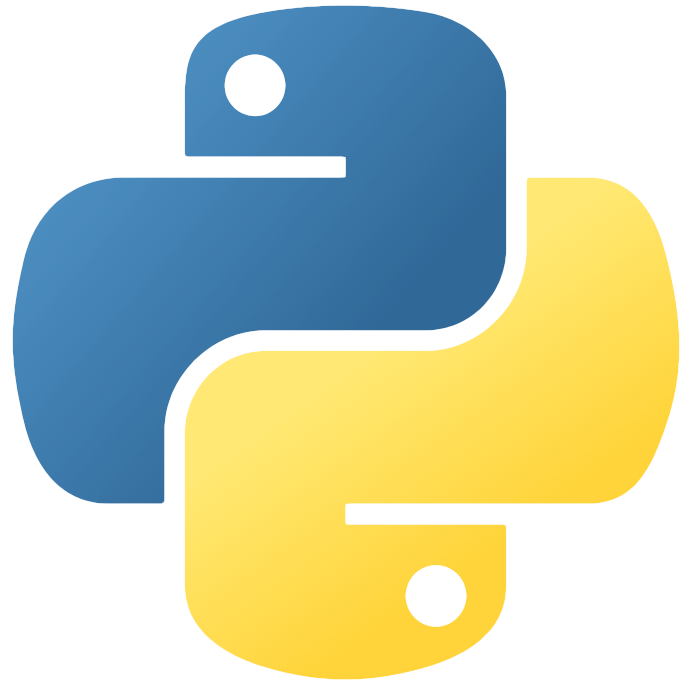

# Data Structures and Algorithms

## Challenges

Type | Difficulty | Name | Solutions |
:-|:-:|:-|:-:|
Arrays | Easy | [Sorted Squared Array](Arrays/Easy/sorted_squared_array/description.md) | 
Arrays | Easy | [Two Sum](Arrays/Easy/two_number_sum/description.md) | 
Arrays | Easy | [Validate Subsequence](Arrays/Easy/validate_subsequence/description.md) | 
Arrays | Medium | [Monotonic Array](/Users/thaddeuspearson/Desktop/repositories/education/Data_Structures_and_Algorithms/Arrays/Easy/monotonic_array/description.md) | 
Arrays | Medium | [Spiral Matrix](/Users/thaddeuspearson/Desktop/repositories/education/Data_Structures_and_Algorithms/Arrays/Medium/spiral_matrix/description.md) | 
Arrays | Medium | [Three Number Sum](/Users/thaddeuspearson/Desktop/repositories/education/Data_Structures_and_Algorithms/Arrays/Medium/three_number_sum/description.md) | 
Searching | Easy | [Binary Search](/Users/thaddeuspearson/Desktop/repositories/education/Data_Structures_and_Algorithms/Searching/Easy/binary_search/description.md) | 
Strings | Easy | [Common Chars](/Users/thaddeuspearson/Desktop/repositories/education/Data_Structures_and_Algorithms/Strings/Easy/common_chars/description.md) | 
Strings | Easy | [Inverted Pairs](/Users/thaddeuspearson/Desktop/repositories/education/Data_Structures_and_Algorithms/Strings/Easy/reverse_word_pairs/description.md) | 
Strings | Easy | [Is Palindrome](/Users/thaddeuspearson/Desktop/repositories/education/Data_Structures_and_Algorithms/Strings/Easy/is_palindrome/description.md) | 
Strings | Easy | [Parens Checker](/Users/thaddeuspearson/Desktop/repositories/education/Data_Structures_and_Algorithms/Strings/Easy/parens_checker/description.md) | 
Strings | Medium | [Group Anagrams](/Users/thaddeuspearson/Desktop/repositories/education/Data_Structures_and_Algorithms/Strings/Medium/group_anagrams/description.md) | 
Strings | Medium | [Longest Palindromic Substring](/Users/thaddeuspearson/Desktop/repositories/education/Data_Structures_and_Algorithms/Strings/Medium/longest_palindromic_substring/description.md) | 
Strings | Medium | [Minimum Chars Needed](/Users/thaddeuspearson/Desktop/repositories/education/Data_Structures_and_Algorithms/Strings/Medium/minimum_chars_needed/description.md) | 
Strings | Medium | [One Char Difference](/Users/thaddeuspearson/Desktop/repositories/education/Data_Structures_and_Algorithms/Strings/Medium/one_char_difference/description.md) | 
